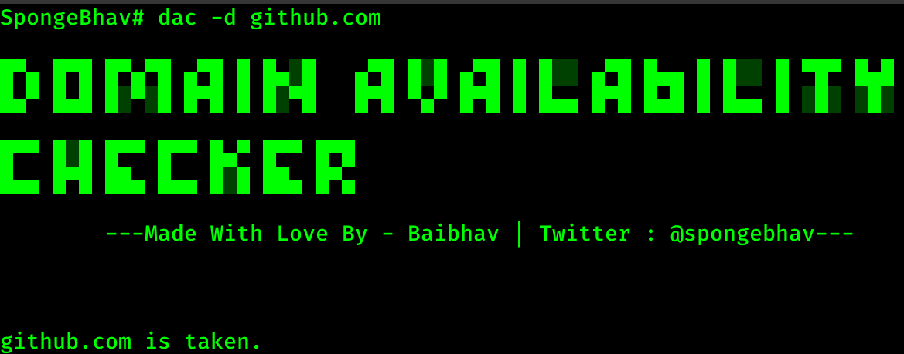
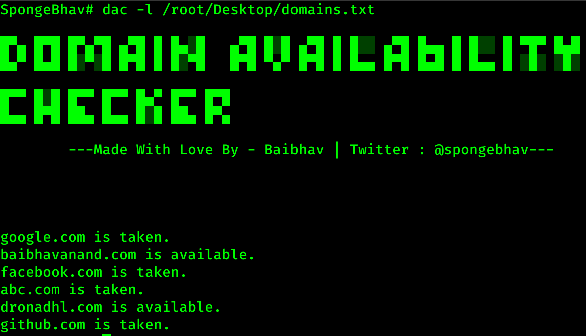
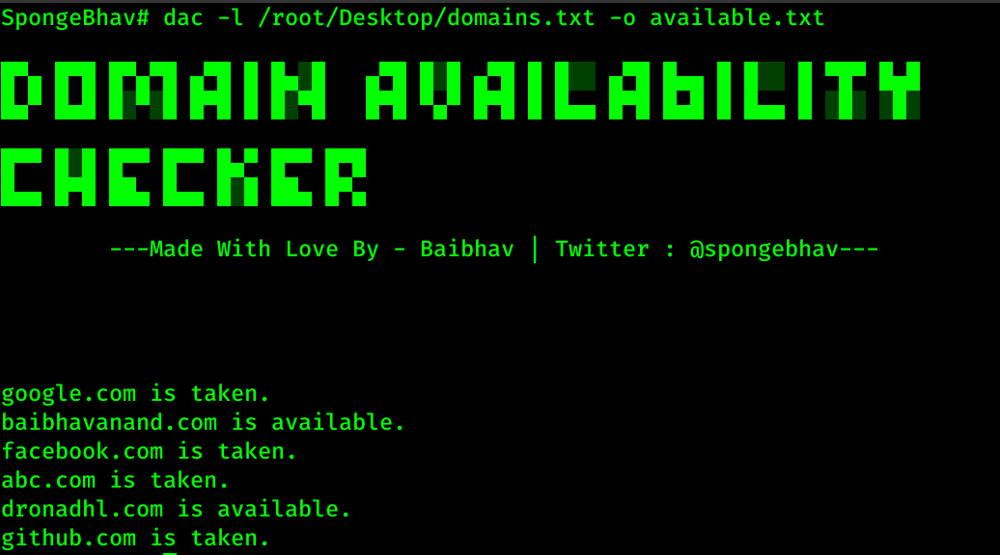
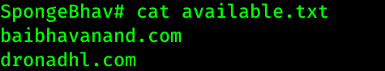
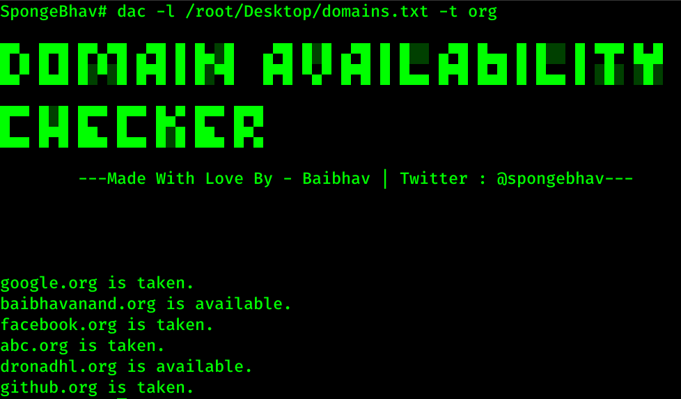

<h1 align="center" style="font-size:36px;font-weight:bold;">
        DAC - Domain Availability Checker 
</h1>

<h4 align="center">
  <strong> Coded with ❤️ by Baibhav. (<a href='https://twitter.com/spongebhav' target="_blank">@spongebhav</a>)</strong>
</h4>

<h2 align="center">
  <strong>About DAC</strong>
 </h2>
 

<strong>DAC - Domain Availability Checker</strong> is a tool written in bash to help people find available domains from the comfort of their terminal. People can chose to pass one domain or wordlist to scan the availability from. People can also chose to store the output (List of available domains) in a different text file.

<h2 align="center">
  <strong>Auto Installation</strong>
 </h2>
 
 * Download OR Clone the repository in your machine:
<pre>git clone https://github.com/baibhavanand/dac</pre>

* Switch to **dac** directory:
<pre>cd dac</pre>

* Give permissions to install.sh file:
<pre>sudo chmod 555 install.sh</pre>

* Run install.sh:
<pre>sudo ./install.sh --install</pre>

<h2 align="center">
  <strong>Manual Installation</strong>
 </h2>

* Download OR Clone the repository in your machine:
<pre>git clone https://github.com/baibhavanand/fbuid</pre>

* Switch to **dac** directory:
<pre>cd dac</pre>

* Copy **dac** to /usr/local/bin
<pre>sudo cp dac /usr/local/bin/</pre>

<h2 align="center">
  <strong>Usage</strong>
 </h2>
 
  Arguments    | Description
------------- |-------------
-d            | Single Domain Name can be passed with -d argument
-l            | File path to wordlist to scan available domains from can be passed through -l argument
-t            | TLD (ex: .com .org .net) to scan from the list can be specified from -t argument. (Default is set to .com)
-o            | To pass file name to save the output (list of available domains) in another text file.

<h2 align="center">
  <strong>Examples</strong>
 </h2>
 
   <pre>dac -d domain.tld</pre>
  This will output if the domain is available or taken.
  
  

    

  <pre>dac -l (path to wordlist)</pre>
  This will output if the domains in the list is available or not
  
  

    

  <pre>dac -l (path to wordlist) -o (filename.txt)</pre>
  This will also scan if the domains in the list is available or not and will save the list of available domains in **filename.txt**
  
  

    

The Saved output will be like this:
  

    

        
  <pre>dac -l (path to wordlist) -t (TLD)</pre>
  This will also scan if the domains in the list is available or not with the tld passed via -t argument.
  
  

    

    

<h2 align="center">
  <strong>LICENSE</strong>
 </h2>
 
 **DAC** is licensed under the **MIT license.** Take a look at the [LICENSE](https://github.com/baibhavanand/dac/blob/main/LICENSE) for more information.
 
 <h2 align="center">
  <strong>Pull Requests</strong>
 </h2>

    

<strong>Pull Requests</strong> for any kind of improvement in **DAC** are welcome.

*While making a PR, make sure to add yourself in thanks.md list.*

<h2 align="center">
  <strong>Thanks</strong>
 </h2>

 
I would like to thank <a href="https://github.com/baibhavanand/dac/blob/main/thanks.md">the following people</a> for contributing to this project.

 

<i>This project is maintained by <a href="https://github.com/baibhavanand">Baibhav Anand Jha</a> | Twitter: <a href="https://twitter.com/spongebhav">@spongebhav</a></i>

